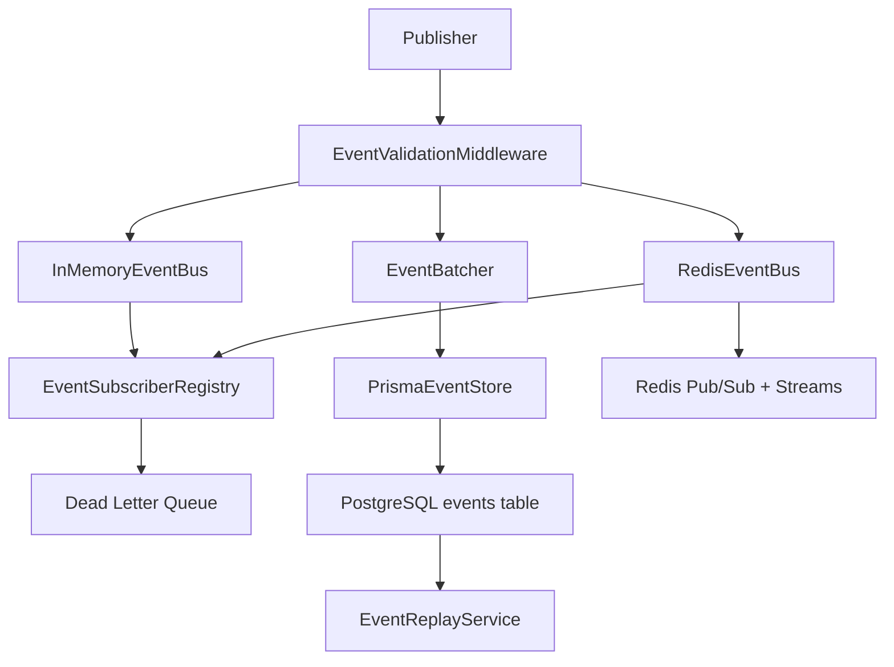

# Event System

Phase 1.3 implements the first production-ready event layer for the AI Office Coding System.

## Implemented Components

- Typed event catalog for agent, task, tool, file, security, and system events
- Zod-backed event schemas and filter schemas
- JSON serializer and deserializer for single events and batches
- Event validation middleware for publish-time and replay-time validation
- Subscriber registry with event-type, session, agent, task, and severity filtering
- In-memory event bus for local mode
- Redis-backed event bus for distributed mode
- Prisma-backed event store for PostgreSQL persistence
- Replay service for loading ordered session timelines from the database
- Event batching utility for high-throughput persistence
- Dead-letter queue for failed subscriber processing

## Architecture

## Files

- `backend/src/events/event-catalog.ts`
- `backend/src/events/event-schema.ts`
- `backend/src/events/event-serializer.ts`
- `backend/src/events/event-validation-middleware.ts`
- `backend/src/events/subscriber-registry.ts`
- `backend/src/events/event-bus.ts`
- `backend/src/events/in-memory-event-bus.ts`
- `backend/src/events/redis-event-bus.ts`
- `backend/src/events/event-store.ts`
- `backend/src/events/event-replay.ts`
- `backend/src/events/event-batcher.ts`
- `backend/src/events/event-dead-letter.ts`

## Validation Strategy

1. All published events are normalized into a single `SystemEvent` shape with `id` and `timestamp`.
2. Invalid event types, malformed UUIDs, and invalid timestamps fail immediately.
3. Subscriber failures do not stop the bus; they are routed into the dead-letter queue.
4. Replay queries are filtered and validated through the same schema path used by publishers.

## Test Coverage

- Unit tests for event validation, serialization, replay frame generation, in-memory bus behavior, dead-letter handling, and batching
- Integration test for Redis-backed event delivery that runs when Redis is reachable
