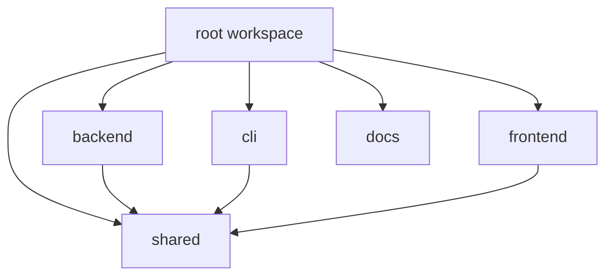
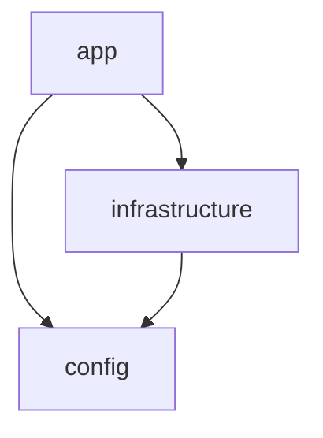

# Module Dependency Graph

This document defines the intended package-level dependencies for the Phase 1 monorepo.

## Workspace Graph

## Layering Rules

1. `shared` contains only framework-agnostic constants, value types, and utility types.
2. `backend` may depend on `shared`, but `shared` must never depend on `backend`.
3. `cli` and `frontend` may depend on `shared`, but not directly on each other.
4. `docs` and `scripts` are support assets and do not publish runtime dependencies.
5. Infrastructure concerns live under `backend/src/infrastructure`, while future domain logic should stay separate.

## Backend Internal Dependency Shape

This keeps the persistence layer reusable while the API and orchestration layers are added later.
